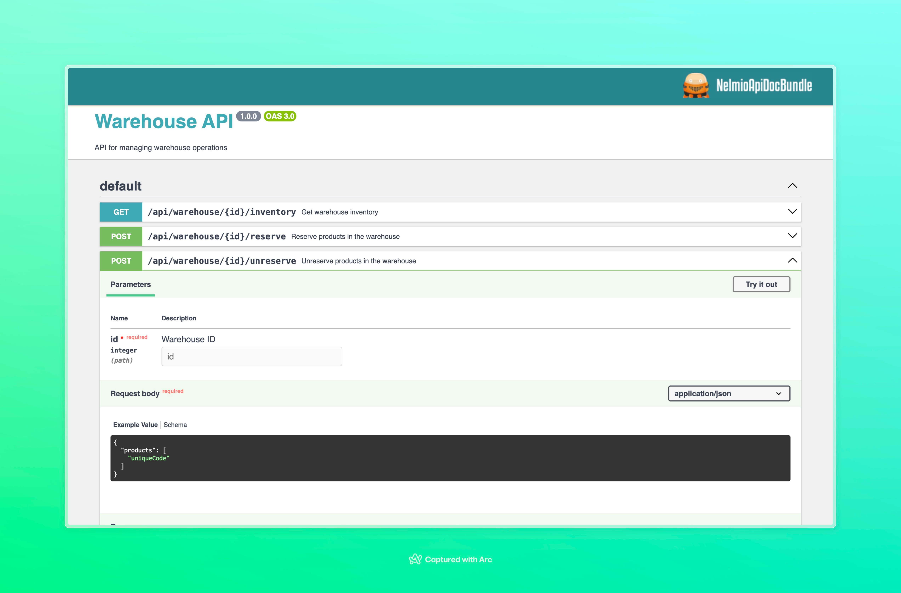

# Warehouse Inventory Management API
This project is a simple warehouse inventory management API built using Symfony 7 and PostgreSQL. The API allows for managing products within warehouses, including reserving and unreserving products for delivery.

## Features
- **Warehouse Management:** Create and manage warehouses.
- **Product Management:** Create and manage products.
- **Inventory Management:** Check inventory levels, reserve products for delivery, and unreserve products.
### Requirements
- PHP 8.2 or higher
- Composer
- Docker and docker compose
- Make 
### Installation
Clone the repository:

`git clone https://github.com/yourusername/warehouse-inventory.git
cd warehouse-inventory`

Install dependencies:

`composer install`

`cp .env.dist .env`

`cp .env.test.dist .env.test`

Build and run Docker containers:

`make up`

### Tests

Build and run Docker containers with app functional tests:

`make tests`

## API Endpoints

The full list of API endpoints and their details can be viewed in the Swagger UI documentation available at:

`http://localhost:8000/api/doc`

You can easily test all API endpoints using the interactive Swagger UI.

### Contributing
Contributions are welcome! Please submit a pull request or open an issue to discuss changes.

###  License
This project is licensed under the MIT License.
